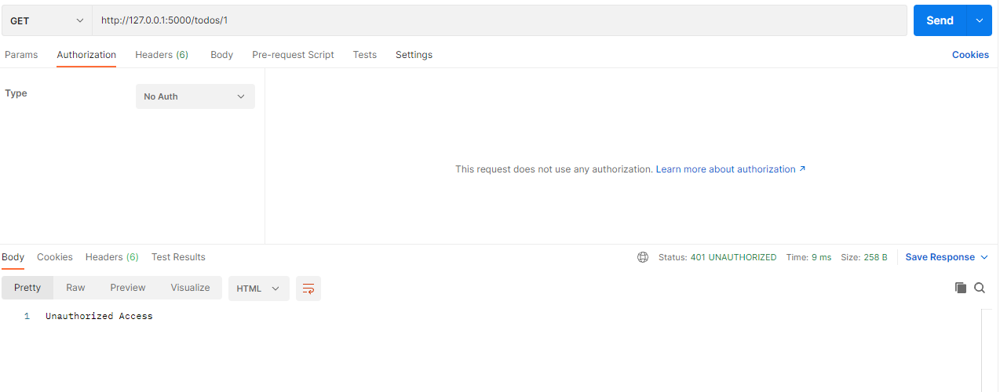
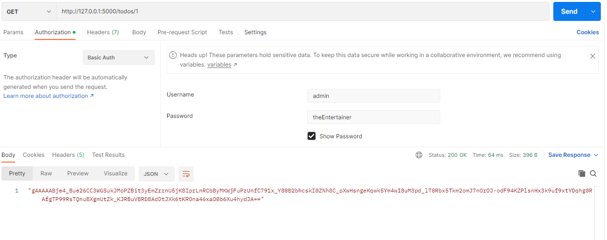
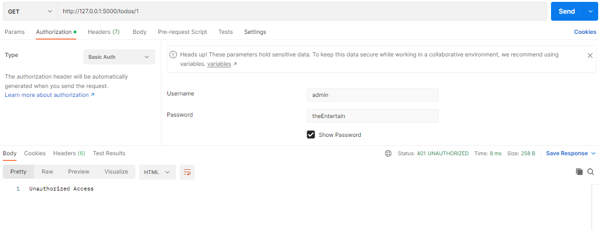
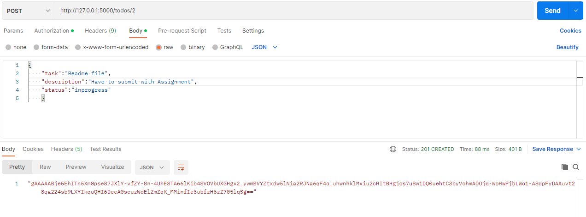
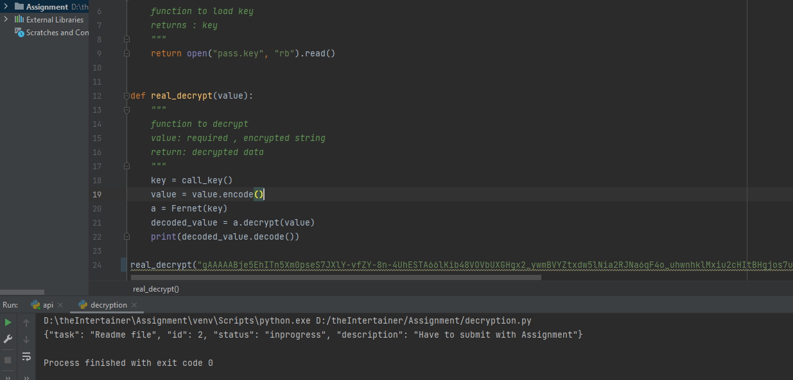

Assignment TODO flask app using flask-restful having create/read/update and delete endpoints, with basic Auth and response encrypted, used sqlite with SQLAlchemy.
=======================================================================

**Requirements:**

- virtualenv
- python 3.9

Installation
------------

After cloning, create a virtual environment and install the requirements. For Linux and Mac users:

    $ virtualenv venv
    $ source venv/bin/activate
    (venv) $ pip install -r requirements.txt

If you are on Windows, then use the following commands instead:

    $ virtualenv venv
    $ venv\Scripts\activate
    (venv) $ pip install -r requirements.txt

Running
-------

To run the server use the following command:

    (venv) $ python api.py
     * Running on http://127.0.0.1:5000/
     * Restarting with reloader

Then from a different terminal window you can send requests or using `Postman`.

How to decrypt API Response
-----------------
Use the cryptography package in Python to decrypt data and from the cryptography library, we need to import Fernet.
- encode the string
- initialize the Fernet class
- pass the encoded byte string and key from pass.key file to decrypt() method
- decode the response
For reference , added decryption code in decryption.py file 

API Documentation
-----------------
All request must be authenticated using an HTTP Basic Auth with `username` and `password` as we have used USERNAME & PASSWORD as credentials. 
username `admin` and password `theEntertainer`

- GET **/todos**

    Return tasks list. 
    On success a status code 200 is returned. The body of the response contains an encrypted string, which on decrypting contain tasks list. 
    On failure status code 400 (bad request) is returned.  
    On failure status code 401 (unauthorized) is returned. 
    On failure status code 404 (Currently, No task exists.) is returned.

- POST **/todos/&lt;int:todo_id&gt;**

    Enter a new task. 
    The body must contain a JSON object that defines `task`, `description` and `status` fields. 
    On success a status code 201 is returned. The body of the response contains an encrypted string, which on decrypting contains newly added task. 
    On failure status code 400 (bad request) is returned. 
    On failure status code 401 (unauthorized) is returned. 
    On failure status code 409 (Task id &lt;todo_id&gt; already taken) is returned.

- GET **/todos/&lt;int:todo_id&gt;**

    Return a task. 
    On success a status code 200 is returned. The body of the response contains an encrypted string, which on decrypting contains the requested task. 
    On failure status code 400 (bad request) is returned.  
    On failure status code 401 (unauthorized) is returned. 
    On failure status code 404 (Could not find task with id &lt;todo_id&gt;) is returned.

- PUT **/todos/&lt;int:todo_id&gt;**

    Update an existing task. 
    The body may contain a JSON object that defines `task`, `description` and `status` fields. 
    On success a status code 201 is returned. The body of the response contains an encrypted string, which on decrypting contains updated task. 
    On failure status code 400 (bad request) is returned. 
    On failure status code 401 (unauthorized) is returned. 
    On failure status code 404 (Can't update,Task with id &lt;todo_id&gt; does not exist) is returned.

- DELETE **/todos/&lt;int:todo_id&gt;**

    Delete an existing task. 
    On success a status code 204 is returned. 
    On failure status code 400 (bad request) is returned. 
    On failure status code 401 (unauthorized) is returned. 
    On failure status code 409 (Could not find task with id &lt;todo_id&gt) is returned.

Example
-------

The following shows access to get method resource without credentials:

Using Credentials to access  get method resource:

Using the wrong credentials the get method  resource is refused:

Using Credentials to access post method resource(add new task):

The following shows decrypted post request response(new added tasks response):

Link to postman collection:
-------
 Use this after running server

[TodoApi's Postman Collection](https://elements.getpostman.com/redirect?entityId=9577708-9a47820c-4f88-4255-b2b0-7a07ddf92482&entityType=collection)
